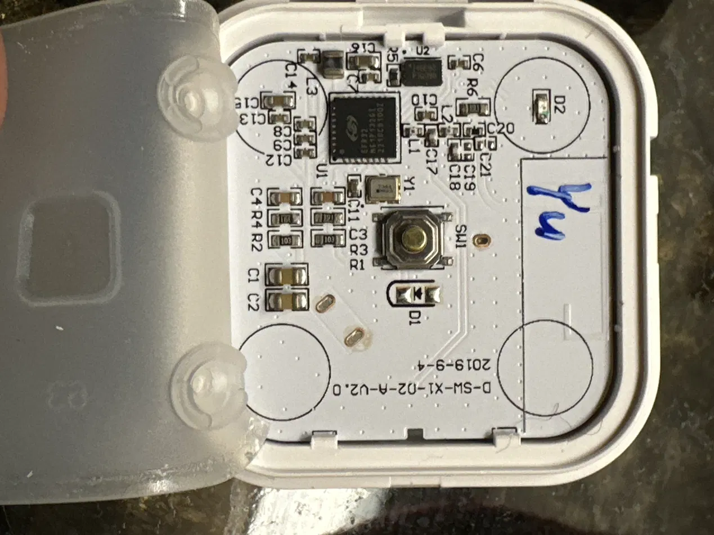
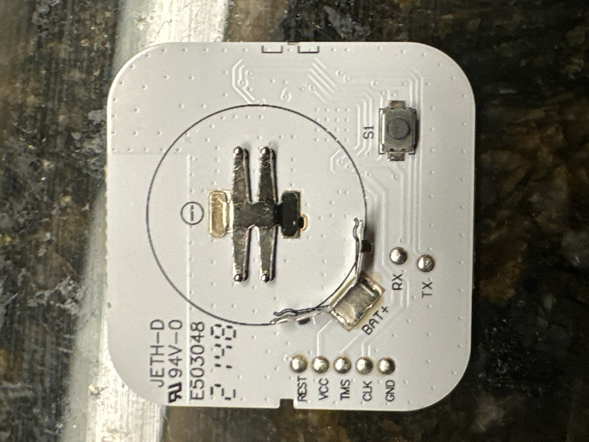
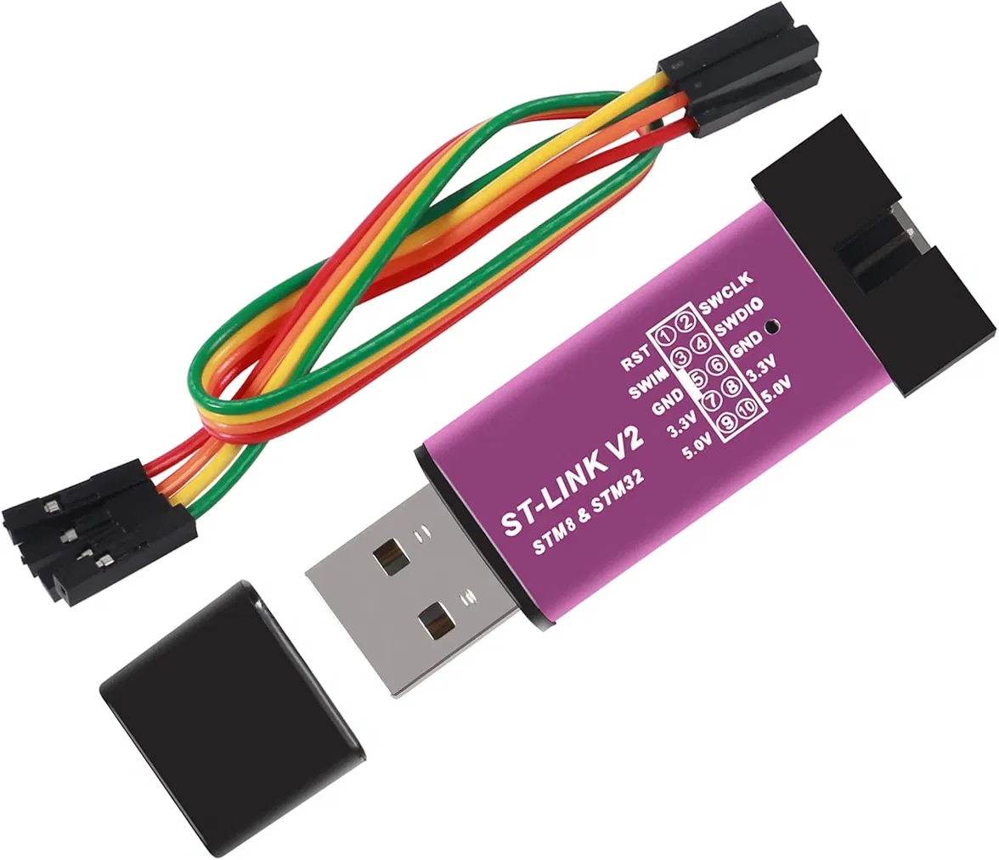
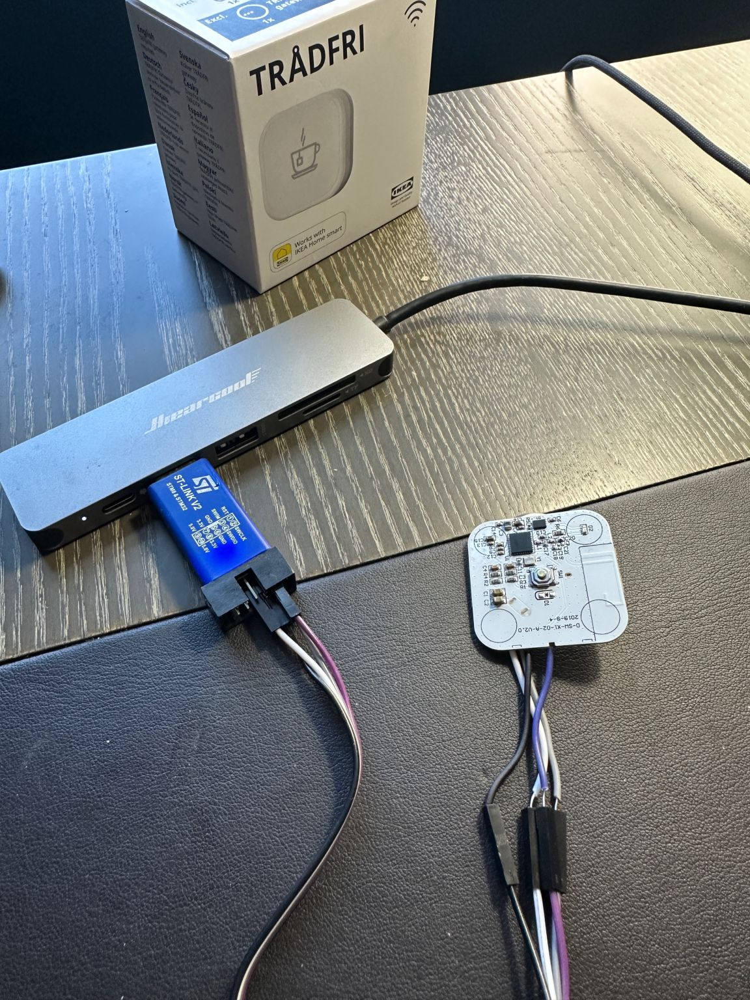

# Reviving a Dead IKEA TRÅDFRI Shortcut Button via SWD Firmware Recovery

A $12 IKEA TRÅDFRI Shortcut Button (E1812), bought on closeout, died from a documented low-battery firmware bug. Extra frustrating because it was never actually used before it failed. This repo documents the full recovery: diagnosis, root cause, tooling, and the direct-to-chip firmware flash that brought it back to life.

## The Problem

The button paired to Home Assistant (ZHA) successfully but was set aside unused. At some point its original battery drained to a critically low voltage. When a fresh battery was installed, the device would rejoin the Zigbee network and report basic attributes (battery %, LQI). However, any command sent to it failed with:

```
Failed to send request: <Status.NWK_NO_ROUTE: 205>
```

This happened consistently even at point-blank range from the Zigbee coordinator, and survived multiple factory resets and rejoin attempts, ruling out mesh topology/routing as the cause.

## Root Cause

IKEA's own official release notes (v2.3.080, released 27 Oct 2021) confirm a known firmware defect for this exact product line:

> TRÅDFRI remote, SYMFONISK sound remote, TRÅDFRI shortcut button (2.3.080) Product ID: E1524, E1810, E1744, E1812
> ◆ Fixed the issue of remotes losing connection due to low battery
> ◆ Increased security regarding upgrade of firmware

Source: https://ww8.ikea.com/ikeahomesmart/releasenotes/releasenotes.html

The working theory: a brownout during a flash write operation (triggered by the critically low battery voltage) left the chip's application firmware in a corrupted state: alive enough to join the network and report simple attributes, but unable to complete bidirectional command handshakes. Since the device could no longer reliably communicate, the normal wireless (OTA) update path that would have delivered the fix was itself unusable, a catch-22 that required bypassing the radio entirely.

## Hardware

- Chip: Silicon Labs EFR32MG1P132F256 ("Mighty Gecko"), Cortex-M4
- Board revision: D-SW-X1-02-A-V2.0, dated 2019-9-4
- The board has labeled test pads on the back: `REST`, `VCC`, `TMS`, `CLK`, `GND` (plus `RX`/`TX` for UART, unused here)





## Tools Used

| Tool | Purpose |
|---|---|
| OpenOCD | Talks to the SWD debug probe, provides a GDB server for the target chip |
| arm-none-eabi-gdb | Issues the actual read/write commands to the chip |
| zigpy-cli | Strips IKEA's OTA signature wrapper to expose the raw firmware image |
| Simplicity Commander (CLI) | Converts the extracted `.gbl` into a properly-addressed `.hex` file |
| Debugger | Generic $6 "ST-Link V2" clone — works as a vendor-agnostic SWD probe for any ARM Cortex-M chip, not just ST's own silicon |



## Wiring

| Board pad | Debugger pin |
|---|---|
| REST | RST |
| TMS | SWDIO |
| CLK | SWCLK |
| GND | GND |

VCC was connected to the debugger's 3.3V pin to power the board directly (no battery installed during the procedure).

Connections were made with fine solder-tack wiring directly to the labeled pads, no permanent soldering, no pogo-pin jig required.



## Procedure

### 1. Confirm the debug connection (read-only, zero risk)

```bash
cat > openocd.cfg << 'EOF'
source [find interface/stlink.cfg]
transport select hla_swd
source [find target/efm32.cfg]
adapter speed 100
EOF
openocd -f openocd.cfg
```

Expected output includes:

```
Info : [efm32.cpu] Cortex-M4 r0p1 processor detected
Info : detected part: EFR32MG1P Mighty Gecko, rev 172
Info : starting gdb server for efm32.cpu on 3333
```

### 2. Back up the current (broken) flash contents

In a second terminal, with OpenOCD still running:

```bash
arm-none-eabi-gdb --batch \
  -ex "target extended-remote localhost:3333" \
  -ex "monitor reset halt" \
  -ex "dump binary memory backup.bin 0x0 0x40000" \
  -ex "detach" -ex "quit"
```

This produces a 262144-byte (256 KiB) full flash dump — both a safety net and proof the toolchain works end-to-end before attempting a write.

### 3. Source the corrected firmware

IKEA hosts current firmware images at a live, official endpoint:

```
https://fw.ota.homesmart.ikea.net/feed/version_info.json
```

Searching that feed for the shortcut button's `fw_image_type` yields the direct download URL for the current signed firmware (v24.4.6 at time of writing, a later release that incorporates the 2.3.080 fix plus subsequent improvements):

```bash
curl -O http://fw.ota.homesmart.ikea.net/global/GW1.0/01.21.057/bin/10054470-tradfri_shortcut_button-24.4.6-prod.ota.ota.signed
```

### 4. Extract the signed wrapper

```bash
python3 -m venv zigpy-env
source zigpy-env/bin/activate
pip install zigpy-cli
zigpy ota dump-firmware \
  10054470-tradfri_shortcut_button-24.4.6-prod.ota.ota.signed \
  shortcut-24.4.6.gbl
```

Verify the result is a genuine GBL file (magic bytes `eb 17 a6 03`):

```bash
xxd -l 16 shortcut-24.4.6.gbl
```

### 5. Convert to a properly-addressed flashable file

GBL files carry their own internal addressing; converting to `.hex` (rather than a flat `.bin`) preserves this, avoiding the need to manually determine the application's flash offset (`0x4000` on this chip — the first 16 KiB is occupied by the bootloader).

```bash
commander convert shortcut-24.4.6.gbl --outfile shortcut-24.4.6.hex
```

This is a pure file-format conversion, no debugger connection required.

### 6. Flash it

```bash
openocd -f openocd.cfg
```

In a second terminal:

```bash
arm-none-eabi-gdb --batch \
  -ex "target extended-remote localhost:3333" \
  -ex "monitor reset halt" \
  -ex "monitor flash write_image erase shortcut-24.4.6.hex" \
  -ex "monitor reset run" \
  -ex "detach" -ex "quit"
```

Note: a naive `restore <file>` from within GDB will be rejected — `Writing to flash memory forbidden in this context` — because flash requires a proper erase-then-program sequence, not a raw memory poke. OpenOCD's own `flash write_image erase` command handles this correctly.

## Result

Immediately after `reset run`, the device resumed communicating on the Zigbee network, using its original network credentials, no repairing needed. The exact command that had failed with `NWK_NO_ROUTE` on every previous attempt (`button.press` on the identify entity) succeeded cleanly on the first try post-flash.

The button is now wired into Home Assistant to toggle a smart plug on each press.

## Acknowledgments

This repair leaned heavily on prior reverse-engineering work by the community, particularly:

- [nomis/ikea-tradfri-e1812](https://github.com/nomis/ikea-tradfri-e1812) — hardware documentation, pad locations, and SWD procedure for this exact device
- [basilfx/TRADFRI-Hacking](https://github.com/basilfx/TRADFRI-Hacking) — related reverse-engineering of IKEA's EFR32-based Zigbee devices
- The [zigpy](https://github.com/zigpy/zigpy) project and its OTA tooling

## Disclaimer

This process writes directly to a chip's flash memory over its debug port, bypassing all vendor safety/update mechanisms. It's done at your own risk. In this case the device was already fully non-functional, so there was no working state to lose — treat a device that's still partially working with more caution.
